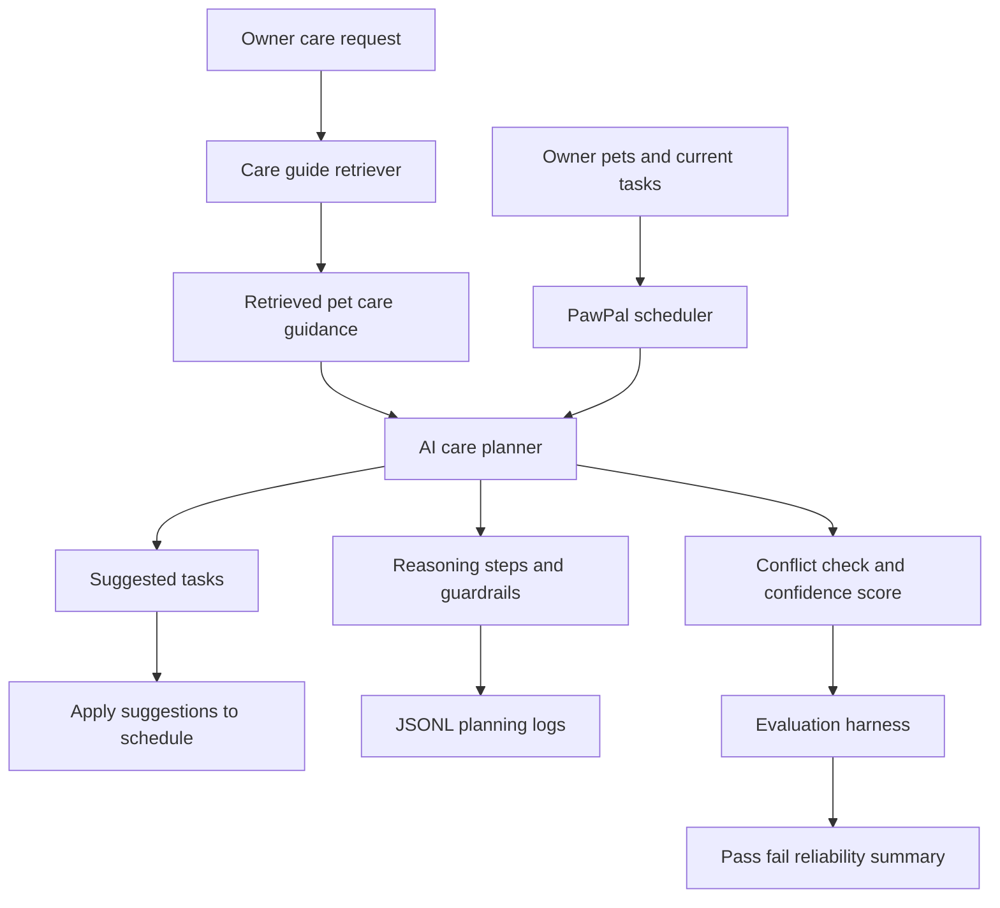

# PawPal AI: Applied Pet Care Planning System

## Original Project

This final project extends my **Module 2 PawPal+ project**. The original project was an object-oriented pet care scheduler that let an owner add pets, create care tasks, sort tasks by time or priority, detect same-time conflicts, mark recurring tasks complete, persist data to JSON, and use a Streamlit interface.

PawPal AI keeps that Module 2 foundation and adds an applied AI planning layer. The new system retrieves pet-care guidance, proposes schedule tasks, checks conflicts, applies guardrails, logs reasoning traces, and evaluates reliability.

## Visual Demo

Open `pawpal_website_demo.html` in a browser for a polished project overview with a cartoon PawPal AI infographic and sample schedule.

```text
pawpal_website_demo.html
assets/pawpal-ai-infographic.png
```


## Summary

PawPal AI helps a pet owner turn a care goal into a safer daily routine. For example, if the owner says a dog needs a walk and medication reminder, the system retrieves exercise and medication guidance, suggests concrete tasks, flags overlaps, and explains the plan.

This is not veterinary advice. It is a scheduling assistant for owner-provided care routines.

## Architecture

The Mermaid source file is stored at `diagrams/architecture.mmd`.



## AI Features

- **Retrieval-Augmented Generation:** `pawpal_ai.py` retrieves care guidance from `data/care_guides.csv`.
- **Agentic Workflow:** the planner follows multiple steps: retrieve guidance, create task suggestions, simulate schedule impact, detect conflicts, generate reasoning steps, apply guardrails, score confidence, and log the run.
- **Specialization:** `data/style_examples.csv` provides small few-shot style templates for care-coach, safety, and busy-owner explanations.
- **Reliability Harness:** `evaluate_ai.py` runs predefined cases and prints pass/fail results.

## Setup

```bash
python -m venv .venv
.venv\Scripts\activate
pip install -r requirements.txt
```

## Run The CLI Demo

```bash
python main.py
```

Sample output:

```text
PawPal+ schedule for Jordan
================================
Today's Schedule
  07:30 - Luna: Breakfast (10 min, high, daily, 2026-07-01, open)
  08:00 - Mochi: Morning walk (30 min, high, daily, 2026-07-01, open)
  08:00 - Luna: Brush coat (15 min, medium, once, 2026-07-01, open)
  12:00 - Mochi: Heartworm medication (5 min, high, once, 2026-07-01, open)

PawPal AI Care Plan
===================
  Step: Matched request to medication guidance for dog care.
  Step: Matched request to exercise guidance for dog care.
  Step: Detected schedule overlap after adding suggested tasks.
  Suggested: 12:00 - Mochi: AI medication check (5 min, high, daily, 2026-07-01, open)
  Suggested: 08:00 - Mochi: AI suggested walk (30 min, high, daily, 2026-07-01, open)
  Brief: Care coach: For Mochi, prioritize AI medication check because Medication tasks should be high priority and easy to notice in the daily schedule.
  Confidence: 0.95
  Guardrail: Do not invent medication names or dosages; only remind for owner-provided care tasks.
  Applied suggested tasks: 2
```

## Run The Streamlit App

```bash
python -m streamlit run app.py
```

The app includes the original PawPal+ task manager and a PawPal AI Care Planner section.

## Tests And Evaluation

Run unit tests:

```bash
python -m pytest
```

Output:

```text
collected 13 items
tests\test_pawpal.py .............                                       [100%]
============================= 13 passed in 0.02s ==============================
```

Run the reliability harness:

```bash
python evaluate_ai.py
```

Output:

```text
PawPal AI Reliability Evaluation
================================
PASS: dog exercise request retrieves exercise guide
  Pet: Mochi
  Retrieved: exercise, medication
  Suggested tasks: AI suggested walk, AI medication check
  Confidence: 0.95
PASS: cat grooming request creates grooming task
  Pet: Luna
  Retrieved: grooming, feeding
  Suggested tasks: AI grooming session, AI feeding reminder
  Confidence: 0.95
PASS: medication request includes safety guardrail
  Pet: Mochi
  Retrieved: medication, exercise
  Suggested tasks: AI medication check, AI suggested walk
  Confidence: 0.95

Summary: 3 out of 3 checks passed.
```

## Optional Stretch Features

| Stretch Feature | Evidence |
|---|---|
| RAG Enhancement | Custom pet-care guidance corpus in `data/care_guides.csv`; retrieved guidance changes suggested tasks and guardrails. |
| Agentic Workflow Enhancement | Multi-step planning and reasoning traces in `pawpal_ai.py`; JSONL logs in `logs/`. |
| Fine-Tuning or Specialization | Few-shot style templates in `data/style_examples.csv`; outputs can use care-coach, safety, or busy-owner styles. |
| Test Harness or Evaluation Script | `evaluate_ai.py` runs predefined cases and prints pass/fail results, confidence, retrieved topics, and suggested tasks. |

## Design Decisions

I kept the original Module 2 object-oriented classes because they already modeled the scheduling domain well. The AI layer sits on top of the scheduler instead of replacing it, which keeps the system explainable and testable.

The planner simulates suggested tasks before applying them, so it can detect conflicts without silently changing the real schedule. Suggested tasks are only added when `apply_suggested_tasks()` is called.

## Limitations

- The care guide corpus is small and manually written.
- The system does not know a pet's medical history.
- It should not invent medication names, dosages, or treatment advice.
- Conflict detection only catches exact same-date and same-time overlaps.
- A real pet care app would need owner confirmation, reminders, and veterinarian-approved guidance.

## Reflection

This project taught me that an applied AI system can be useful without being a black-box model. Retrieval, planning, guardrails, logs, and tests can make a simple scheduler feel smarter while still keeping the behavior understandable.
